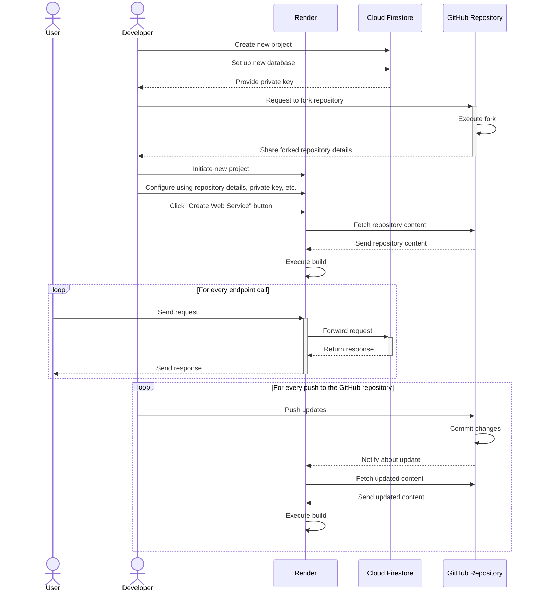

# Toolkit for Collaborative XR

This is an experimental toolkit designed for the workshop at 未來智慧工場 (Atelier Future) of National Cheng Kung University (NCKU) in 2023. The toolkit consists of an API server and examples, and we assume that XR scenes are created on the [STYLY](https://gallery.styly.cc/about/en) platform using [Unity](https://unity.com/), [PlayMaker](https://hutonggames.com/), and [STYLY Plugin for Unity](https://styly.cc/download/). This toolkit allows you to build a common reference base between scenes, bringing consistency to the XR experience.

## Philosophy

- **No Black Boxes**: Remember the first time you wrote a "Hello, World!" in Python? That sense of achievement you felt? We believe in keeping things transparent. If you have the basics of Python under your belt, you'll be able to dive into our code, understand it, and even modify it to your heart's content. No mysteries here!
- **Minimalism at its Best**: Our API server is like a blank canvas. We provide just the essential functions to get you started. But guess what? You're the artist here! Add features, modify existing ones, and paint your masterpiece. Our tool grows as you grow.
- **Abundant Documentation**: Ever felt lost while using a tool? We've been there. That's why we've put together a comprehensive guide to help you out. Check out `api_documentation.md` for detailed insights and instructions. It's like having a friendly guide by your side!

## Essential Concepts

### Role

- In our system, every user has a specific role. The roles are:
  - **Designer**: Responsible for creating and managing locations, items, and tags.
  - **Player**: Interacts with items, acquires them, and communicates using message boards.
  - **Sensor**: Updates the status of items based on physical-world inputs.
  - **Actuator**: Acts upon or responds to item statuses.
- Each role has a unique API key, ensuring secure and role-specific interactions.

### Location

- Every item is associated with a location. Locations are of two types:
  - `INDOOR`: For items inside buildings or confined spaces.
  - `OUTDOOR`: For items in open areas or natural environments.
- For items in an `INDOOR` location, we specify their position using three coordinates: x, y, and z.
- For items in an `OUTDOOR` location, we use geographical coordinates: latitude (north-south position) and longitude (east-west position).

### Item

- Items are objects or entities you can interact with. Each item has:
  - **Name**: An identifier or label for the item.
  - **Owner**: Indicates who currently possesses the item. By default, items belong to `PUBLIC_DOMAIN`, meaning they are available for all. Once a player acquires an item, its ownership changes to `A_PLAYER`.
  - **Type**: Describes the category of the item.
  - **Coordinates**: Specifies the item's position in its location.
  - **Tags** (optional): Keywords to help categorize and filter items.
  - **Attributes** (optional): Additional properties or details about the item.

### Tag

- Tags are like labels. They help in organizing and finding items based on specific categories or properties. For example, if you're searching for a specific type of item, you can use tags to filter and find them quickly.

## Essential Components

In the development and deployment of this API, we utilized a combination of modern technologies and platforms to ensure robustness, scalability, and ease of use. Here's an overview:

### Flask

- **What it is**: [Flask](https://flask.palletsprojects.com/) is a lightweight web framework written in Python. It's designed for quick and easy development of web applications.
- **Role in this API**: Flask serves as the backbone of our API server. We use it to define endpoints, handle requests, and send responses to users.

### Cloud Firestore

- **What it is**: [Cloud Firestore](https://firebase.google.com/products/firestore) is a flexible, scalable, and NoSQL cloud database from Google Firebase. It allows for real-time data synchronization and offers robust querying capabilities.
- **Role in this API**: Cloud Firestore acts as our primary database. We store details like locations, items, and tags here. Its real-time capabilities ensure that users always interact with the most up-to-date data.

### Render

- **What it is**: [Render](https://render.com/) is a Platform as a Service (PaaS) that offers cloud computing services. It simplifies the process of deploying, scaling, and managing applications and databases.
- **Role in this API**: We use Render to host our Flask-based API server. It ensures that the API is always available and can handle multiple requests simultaneously. Render's infrastructure also ensures smooth scaling as the number of users grows.

## How to launch your own API server

This sequence diagram provides a step-by-step representation of setting up a server using Cloud Firestore as a database and Render as a Platform-as-a-Service (PaaS). The flow captures interactions between the developer, user, Render, Cloud Firestore, and GitHub repository, highlighting the key actions from project creation to deploying updates.



### Create a database

1. Navigate to the Firebase console: [https://console.firebase.google.com/](https://console.firebase.google.com/).
2. Click `Add project` and follow follow the on-screen instructions to create a Firebase project (you may uncheck the toggle button for `Enable Google Analytics for this project` to disable Google Analytics).
3. Once your project is ready, click the `Continue` button, then navigate to the `Cloud Firestore` section.
4. Look for `Cloud Firestore` and follow the database creation workflow.
    - Choose `Start in production mode`.
    - Choose a suitable `Cloud Firestore location` (e.g., asia-southeast1: Singapore).
5. Once finished, navigate to the ⚙️ button on the top left → `Project settings` → `Service accounts`.
6. Click the `Generate new private key` button, read the warning, and then click the `Generate key` button to generate a new key (a JSON file) and download the key to your local machine.
7. IMPORTANT: Keep the JSON file in a safe place. You can’t reissue the key; if lost, you'll need to generate a new one.

### Fork the GitHub project and deploy

1. Navigate to [https://github.com/kotobuki/Toolkit-for-Collaborative-XR/](https://github.com/kotobuki/Toolkit-for-Collaborative-XR/).
2. Fork the project.
3. Navigate to [https://render.com/](https://render.com/) and create an account (recommended to use a GitHub account).
4. Click on the `New +` button on the top-right and choose `Web Service`.
5. Click the `Connect account` button under the GitHub icon.
6. Choose `Only select repositories` for the `Repository access` and select the forked repository.
7. Choose `Standard` for the `Instance Type`.
8. Click on the `Advanced` button.
    - Navigate to the `Start Command` section and set `gunicorn server:app` as the start command.
    - Navigate to the `Environment Variables` section and set the following environment variable keys with their respective values:
        - `API_KEY_DESIGNER`: `abcdefgh00000000`
        - `API_KEY_PLAYER`: `abcdefgh00000001`
        - `API_KEY_SENSOR`: `abcdefgh00000002`
        - `API_KEY_ACTUATOR`: `abcdefgh00000003`
        - `SERVICE_ACCOUNT_KEY_JSON`: Copy and paste the content of the generated key file. **Ensure this content remains confidential.**
9. Click on the `Create Web Service` button to start deploying.

## How to test the API server locally

This guide provides a step-by-step procedure for setting up and testing the API server on your local machine. Whether you are a developer or just someone curious to run the API server, by following these steps, you will have a locally running instance of the server. This is especially useful for debugging, feature development, or simply understanding the inner workings of the API.

1. Clone the repository.
2. Open a terminal in the repository directory.
3. Create a virtual environment and activate the environment.

    ```shell
    python3 -m venv .venv
    . .venv/bin/activate
    ```

4. Install the required dependencies. Additionally, if you don't have `jq` installed and you're on macOS with Homebrew, you can install it as shown below. For other platforms, please consult [the `jq` official documentation](https://jqlang.github.io/jq/download/) for installation instructions.

    ```shell
    pip install -r requirements.txt
    brew install jq
    ```

5. Export the environment variables. Remember to replace `service-account-key.json` with the path to your previously downloaded Firebase key file.

    ```shell
    export API_KEY_DESIGNER=abcdefgh00000000
    export API_KEY_PLAYER=abcdefgh00000001
    export API_KEY_SENSOR=abcdefgh00000002
    export API_KEY_ACTUATOR=abcdefgh00000003
    SERVICE_ACCOUNT_KEY_JSON=$(jq -c . service-account-key.json)
    export SERVICE_ACCOUNT_KEY_JSON
    ```

6. Run the server app in the environment.

    ```shell
    gunicorn server:app
    ```

7. After running the server, check the terminal for a message indicating the listening address. This address (for example, `http://127.0.0.1:8000`) is the base URL you'll use to access the API.

    ```shell
    [INFO] Listening at: http://127.0.0.1:8000
    ```

## How to use the utilities

### Generate `api_documentation.md` from `server.py`

```shell
python docstring_to_md.py server.py
```

### Generate `test_client.html` from `server.py`

```shell
python docstring_to_test_client.py server.py
```

### Test the API with the `test_client.html`

1. Open `test_client.html` in your web browser.
2. Fill in the Base URL and API Key fields.
3. Choose a role from radio buttons (e.g., Designer).
4. Choose an endpoint, fill in the parameters, and press the Submit button.

### Measure response time of each endpoint

Install necessary packages and run the test script.

```shell
pip install numpy tqdm
python api_test.py {full_url_with_parameters}
```
