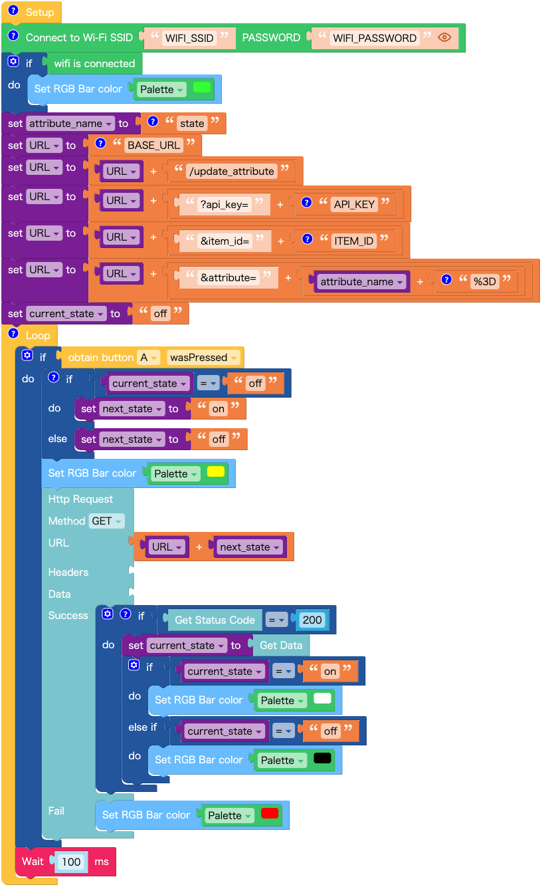

# UIFlow Examples

## Essential Concepts

### M5Stack

[M5Stack Controllers](https://docs.m5stack.com/en/products?id=core) are modular, stackable, scalable, and portable devices driven by an ESP32 core. This core is a single 2.4 GHz Wi-Fi and Bluetooth combo chip. You can seamlessly connect various sensors and actuators without soldering, thanks to the user-friendly [Units](https://docs.m5stack.com/en/products?id=sensor). Multiple development platforms and programming languages are at your disposal, including UIFlow, MicroPython, Arduino, and many others.

### UIFlow

[UIFlow](https://docs.m5stack.com/en/quick_start/m5core/uiflow) provides a visual programming environment. Once your controller is Wi-Fi connected and online, you can begin visual coding directly in your browser without any additional development tool installations.

### Examples

- For ATOM Controllers (e.g., ATOM LITE)
  - `update_attribute_atom.mf5`: Update the `state` attribute of an item using the `/update_attribute` endpoint.
  - `get_attribute_atom.m5f`: Retrieve an attribute of an item via the `/get_attribute` endpoint.
- For Fire Controller:
  - `update_attribute_fire.mf5`: Update the `state` attribute of an item using the `/update_attribute` endpoint.
  - `get_attribute_fire.m5f`: Retrieve the `state` attribute of an item via the `/get_attribute` endpoint.
  - `update_attribute_tof_fire.m5f`: Update the `distance` attribute with a value measured by a ToF sensor of an item via the `/update_attribute` endpoint.
  - `update_attribute_tof_find_edges_fire.m5f`: Update the `distance` attribute using edge detection by thresholding a value measured by a ToF sensor via the `/update_attribute` endpoint.

### Running an Example with UIFlow 1.0

1. Navigate to the UIFlow editor by visiting [https://flow.m5stack.com/](https://flow.m5stack.com/).
2. Select `UIFlow1.0` and click the `Confirm` button.
3. Enter the API key for your controller, select your controller (e.g., `ATOM LITE`, `Fire`), and then click the `OK` button.
4. Click the `Open` button located in the top-right corner.
5. Choose an `.mf5` file.
6. Edit parameters, such as `WIFI_SSID`, and the attribute name if necessary.
7. Click the `Run` button to execute the code.
8. Modify your code as needed.
9. Once finished, click the `Download` button to save the code to your controller (otherwise, the code will be erased if the controller is powered off or reset).

### Utilities

- `remove_secrets.py`: This utility script aids in stripping out sensitive data such as `api_key`, `item_id`, `apikey`, and `uuid` from a .m5f file before repository commits.

## Instructions for Workshop Tutors

1. Refer to [the official tutorial](https://docs.m5stack.com/en/quick_start/m5core/uiflow).
2. Using M5Burner, update the firmware of each controller to the designated version (e.g., `v1.9.6` for ATOM controllers and `v1.12.5` for Fire) with proper Wi-Fi settings.
3. Make a note of the API key for every controller. Share this information with participants in a manner you find suitable, such as attaching a sticky note to a workshop kit box.
